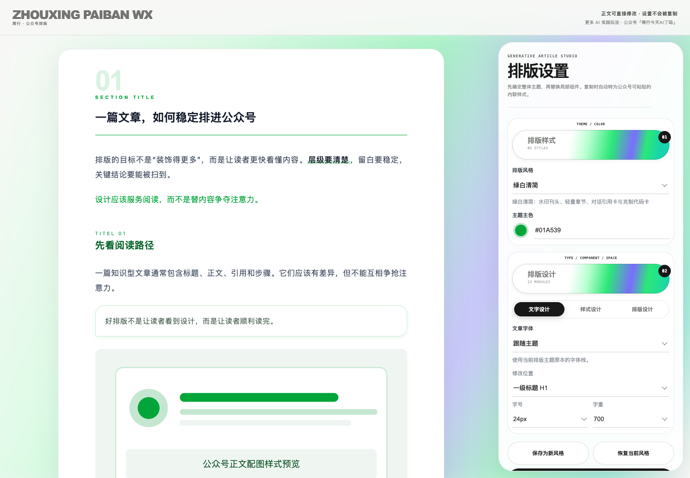
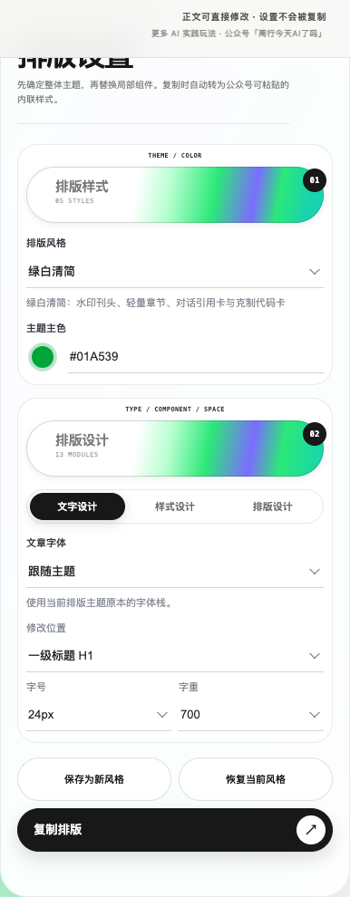
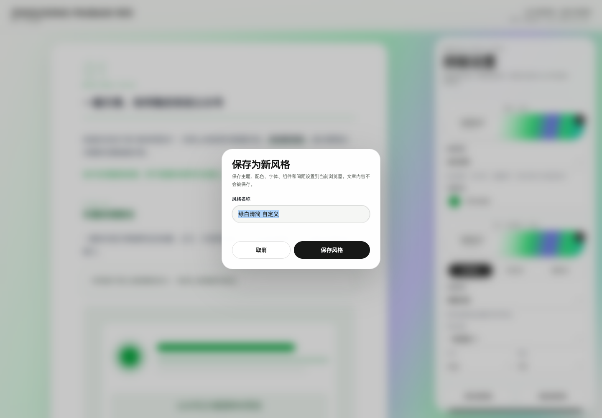
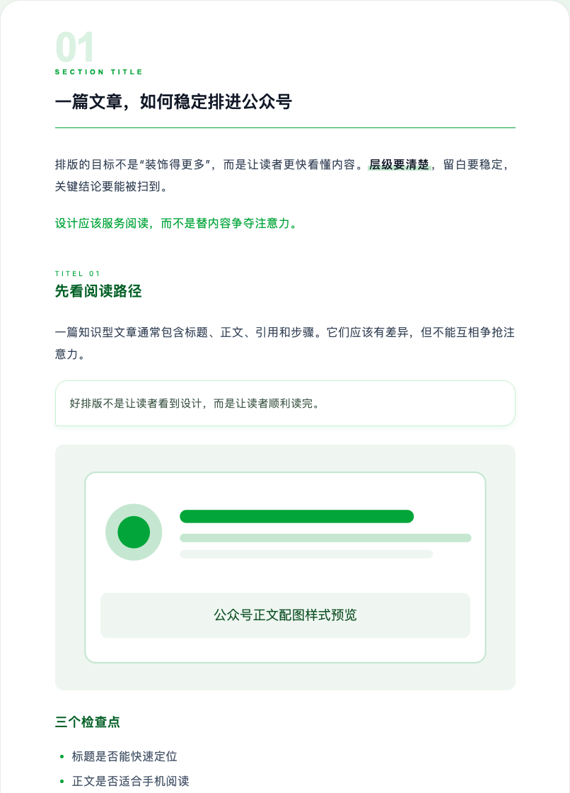
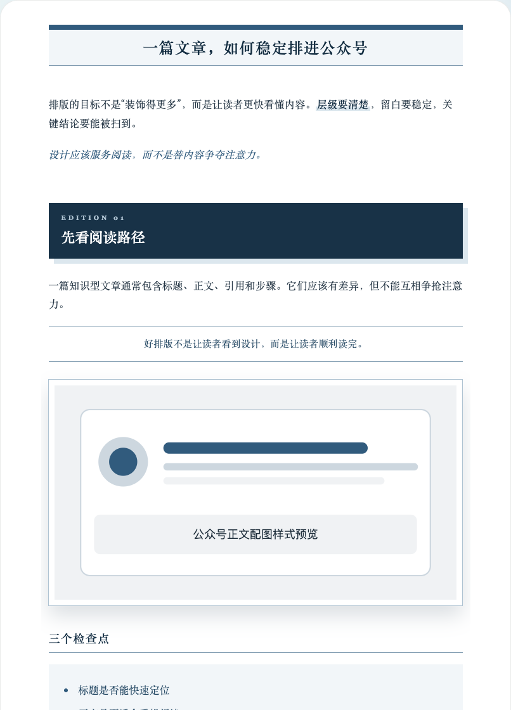
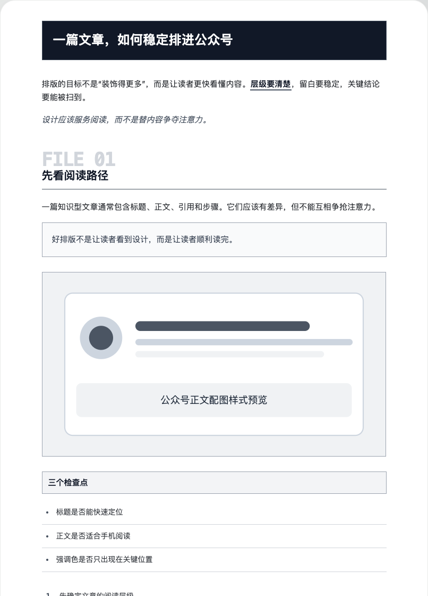
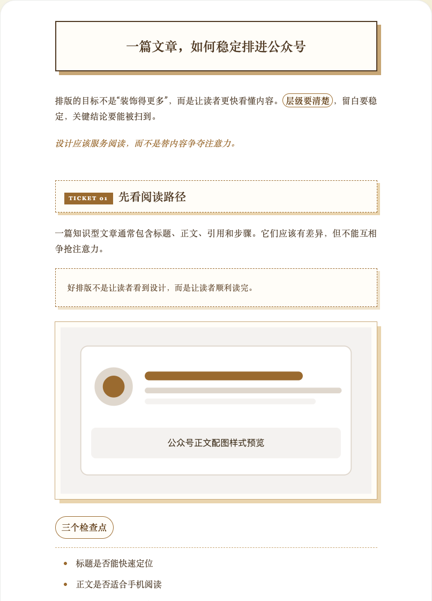
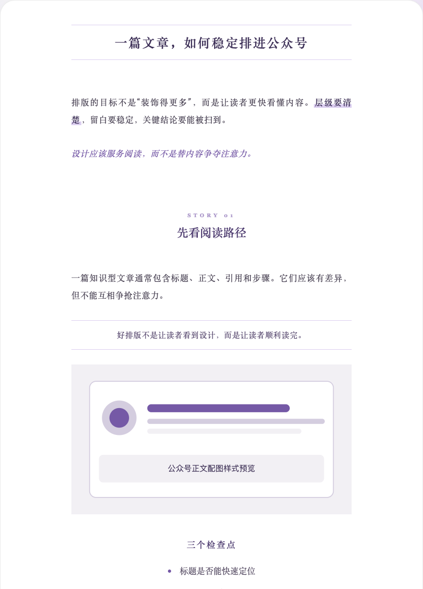

<div align="center">

# ZHOUXING PAIBAN WX

### 让公众号文章从 Markdown 到可粘贴排版，只经过一个实时预览页

<p>
  <a href="https://kianzzz.github.io/zhouxing-paiban-wx/"></a>
  
  
  
  
  
</p>

[在线体验](https://kianzzz.github.io/zhouxing-paiban-wx/) · [功能概览](#功能概览) · [快速开始](#快速开始) · [操作界面](#操作界面) · [主题预览](#主题预览) · [兼容说明](#兼容说明)

</div>



> 输入一篇 Markdown 或已经写好的文章，Skill 会生成可编辑的本地排版页。你可以实时换主题、换组件、调字体和间距，把定稿设置保存为浏览器自定义风格，再复制富文本到公众号编辑器。

不安装 Skill 也可以直接打开 **[在线预览页](https://kianzzz.github.io/zhouxing-paiban-wx/)**，在示例文章上体验完整的排版设置和复制流程。

## 功能概览

| | |
|---|---|
| **文章直接排版**<br>保留原文与标题层级，生成浏览器可打开的单文件预览页。 | **参考风格学习**<br>分析排版截图或文章链接，经确认后沉淀为可复用主题。 |
| **完整主题系统**<br>5 套差异化主题，支持主色与界面流光联动换色。 | **局部组件设计**<br>13 类组件可分别替换，不必为了一个标题样式更换整套主题。 |
| **文字与版面控制**<br>字体、字号、字重、段落、标题和图片间距都可实时调整。 | **DIY 风格保存**<br>将主题、配色、字体、组件和间距保存为当前浏览器的新风格。 |
| **在线可操作预览**<br>不安装 Skill 也可以打开 GitHub Pages 体验完整控件。 | **公众号富文本复制**<br>输出内联样式，并针对列表、表格和视觉装饰做粘贴兼容。 |

## 快速开始

### 1. 安装 Skill

```bash
git clone https://github.com/Kianzzz/zhouxing-paiban-wx.git
cp -R zhouxing-paiban-wx/zhouxing-paiban-wx ~/.codex/skills/
```

### 2. 在 Codex 中调用

```text
使用 $zhouxing-paiban-wx 帮我排版这篇文章，并打开实时预览页。
```

### 3. 调整并复制

在右侧设置栏选择主题、颜色和组件；需要复用时点击“保存为新风格”，新风格会进入原主题下拉菜单。确认效果后点击下方通栏的“复制排版”，到公众号编辑器粘贴检查。

> 其他支持 `SKILL.md` 的 Agent，也可以把仓库中的 `zhouxing-paiban-wx/` 目录复制到对应 Skills 目录。工具权限和本地页面打开方式以实际环境为准。

## 操作界面

<table>
  <tr>
    <td width="58%">
      <strong>排版样式</strong><br><br>
      选择整套主题，并调整主题主色。标题、强调、引用、列表、表格及界面流光会同步换色。<br><br>
      <strong>排版设计</strong><br><br>
      分为文字设计、样式设计和排版设计。可以先选择要修改的位置，再调整字号、字重、组件结构或间距。<br><br>
      <strong>实时正文</strong><br><br>
      左侧文章可以直接修改；工具栏与页面外壳不会进入复制结果。<br><br>
      <strong>保存 DIY 风格</strong><br><br>
      命名后保存为新风格，新风格会出现在“排版风格”菜单。只保存设计参数，不保存文章内容。
    </td>
    <td width="42%" align="center">
      
    </td>
  </tr>
</table>

### 保存自定义风格



保存内容包括基础主题、主色、字体、字号/字重、局部组件和间距，不包含文章正文、图片或链接。保存成功后可在“排版风格”中选择 `自定义 · 风格名`；同一浏览器和同一页面来源内会保留，不会跨设备自动同步。

### 可调整内容

`H1–H6` · `引用块` · `代码块` · `行内代码` · `加粗` · `斜体` · `有序列表` · `无序列表` · `表格` · `分隔线` · `链接` · `图片`

图片支持直角、圆角、阴影、描边及组合形式；各级标题共享样式库，但字号和字重可以分别设置。

## 主题预览

五套主题不是简单换色，而是在标题构图、正文密度、引用结构、图片边界和列表处理上保持明显差异。

<table>
  <tr>
    <th>绿白清简</th>
    <th>墨蓝刊读</th>
    <th>石墨档案</th>
    <th>沙金手记</th>
    <th>雾紫叙事</th>
  </tr>
  <tr>
    <td></td>
    <td></td>
    <td></td>
    <td></td>
    <td></td>
  </tr>
</table>

<details>
<summary><strong>展开查看完整主题长图</strong></summary>

<br>

<table>
  <tr>
    <th>绿白清简</th>
    <th>墨蓝刊读</th>
  </tr>
  <tr>
    <td></td>
    <td></td>
  </tr>
  <tr>
    <th>石墨档案</th>
    <th>沙金手记</th>
  </tr>
  <tr>
    <td></td>
    <td></td>
  </tr>
</table>

<p align="center">
  <strong>雾紫叙事</strong><br><br>
  
</p>

</details>

## 两种使用模式

### 直接排版

提供 Markdown 文件或文章正文，Skill 会解析标题、段落、引用、列表、代码、图片和表格，生成本地实时预览页。排版过程不改写已经定稿的文章。

```text
使用 $zhouxing-paiban-wx 排版这篇 Markdown，使用绿白清简，并打开预览页。
```

### 风格学习

提供排版截图或公众号文章链接，Skill 会先区分已观察、推断和未核实信息，交付风格证据卡；只有确认后才把候选风格写入风格库。

```text
使用 $zhouxing-paiban-wx 分析这张排版截图，确认后保存为新的排版风格。
```

## 兼容说明

- **本地优先**：预览页默认生成在系统临时目录，不上传文章内容。
- **自定义风格**：保存在当前浏览器的当前页面来源中；清除站点数据、更换浏览器或设备后不会自动同步。
- **微信粘贴**：复制结果以内联样式为主，不依赖外部字体、动画或脚本。
- **列表处理**：复制时转换为稳定的普通段落行，减少重复序号和符号错行。
- **表格处理**：采用固定列布局与统一单元格盒模型，降低公众号中的错列概率。
- **最终验收**：本地预览、复制成功、微信编辑器粘贴正常是三个独立步骤，仍需实际粘贴检查。

<details>
<summary><strong>手动构建预览与仓库结构</strong></summary>

### 手动构建

```bash
python3 zhouxing-paiban-wx/scripts/build_preview.py \
  --article "/absolute/path/article.md"
```

### 仓库结构

```text
.
├── README.md
├── docs/images/                  # 操作界面与主题截图
└── zhouxing-paiban-wx/
    ├── SKILL.md                  # Skill 入口
    ├── agents/openai.yaml        # Codex 展示信息
    ├── assets/                   # 预览模板、组件库和主题库
    ├── references/               # 兼容、学习与设计规范
    └── scripts/                  # 构建与校验脚本
```

</details>

## 参考与说明

组件体系的研究过程参考了 [isjiamu/gzh-design-skill](https://github.com/isjiamu/gzh-design-skill) 的语义化组件组织方法；本仓库使用独立的主题名称、结构、样式声明和操作界面。

项目当前主要在 macOS + Codex 环境验证。真实公众号粘贴效果仍应由使用者在微信编辑器中确认。
