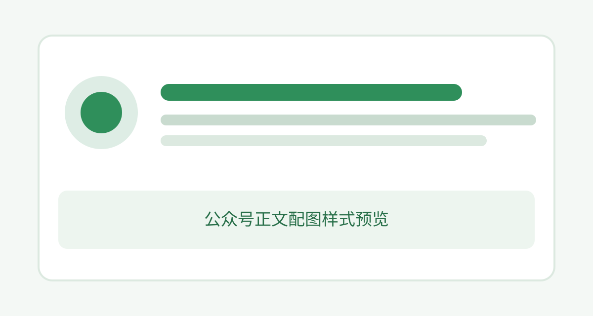

# 一篇文章，如何稳定排进公众号

排版的目标不是“装饰得更多”，而是让读者更快看懂内容。**层级要清楚**，留白要稳定，关键结论要能被扫到。

*设计应该服务阅读，而不是替内容争夺注意力。*

## 先看阅读路径

一篇知识型文章通常包含标题、正文、引用和步骤。它们应该有差异，但不能互相争抢注意力。

> 好排版不是让读者看到设计，而是让读者顺利读完。



### 三个检查点

- 标题是否能快速定位
- 正文是否适合手机阅读
- 强调色是否只出现在关键位置

1. 先确定文章的阅读层级
2. 再选择标题和强调样式
3. 最后检查复制到公众号后的效果

#### 四级标题示例

四级到六级标题也可以独立选择同一套标题样式。

##### 五级标题示例

不同级别只保留各自的字号与字重。

###### 六级标题示例

样式选择不会把所有标题强制成相同字号。

## 再看技术内容

行内代码如 `font-size: 16px` 应该清晰，但不能比正文更抢眼。

```css
.note-to-mp p {
  font-size: 16px;
  line-height: 1.8;
}
```

| 元素 | 作用 |
| --- | --- |
| 标题 | 建立层级 |
| 引用 | 承载关键判断 |

---

最后，在[公众号编辑器](https://mp.weixin.qq.com/)里实际粘贴一次，才算完成兼容性检查。
